# BarChart
Sumon Barua  


Examples were taken from the book: 

* Graphics Cookbook: Practical Recipes for Visualizing Data
* Cookbook for R


Bar graph typically used to display:

* Numeric values (on the y-axis)
* Categories (on the x-axis)

####Heights of bars 

* The count of cases for each group - stat_count - stat="count"
* The value of a column - stat_identity - stat="identity"


```r
#install.packages("gcookbook")
library(gcookbook)
library(tidyverse)
```

```
## Loading tidyverse: ggplot2
## Loading tidyverse: tibble
## Loading tidyverse: tidyr
## Loading tidyverse: readr
## Loading tidyverse: purrr
## Loading tidyverse: dplyr
```

```
## Conflicts with tidy packages ----------------------------------------------
```

```
## filter(): dplyr, stats
## lag():    dplyr, stats
```

```r
pg_mean
```

```
##   group weight
## 1  ctrl  5.032
## 2  trt1  4.661
## 3  trt2  5.526
```

```r
ggplot(pg_mean, aes(x=group, y=weight)) + 
  geom_bar(stat="identity")
```

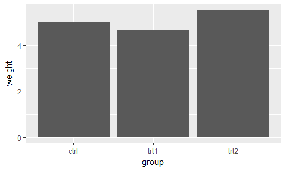<!-- -->

When x is a continuous (or numeric) variable vs discrete (categorical variable with factor())

```r
BOD
```

```
##   Time demand
## 1    1    8.3
## 2    2   10.3
## 3    3   19.0
## 4    4   16.0
## 5    5   15.6
## 6    7   19.8
```

```r
#continuous
ggplot(BOD, aes(x=Time, y=demand)) + 
  geom_bar(stat="identity")
```

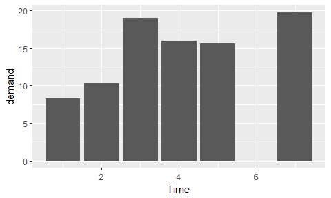<!-- -->

```r
#discrete
ggplot(BOD, aes(x=factor(Time), y=demand)) + 
  geom_bar(stat="identity")
```

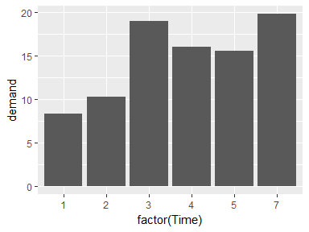<!-- -->

####Colouring - 

* fill - to fill the bars
* colour - bar outline color

```r
pg_mean
```

```
##   group weight
## 1  ctrl  5.032
## 2  trt1  4.661
## 3  trt2  5.526
```

```r
ggplot(pg_mean, aes(x=group, y=weight)) +
  geom_bar(stat="identity", fill="lightblue", colour="black")
```

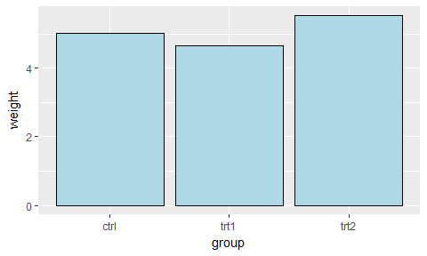<!-- -->

####Grouping bars together

* Map a variable to fill
* Use geom_bar(position="dodge")


```r
cabbage_exp
```

```
##   Cultivar Date Weight        sd  n         se
## 1      c39  d16   3.18 0.9566144 10 0.30250803
## 2      c39  d20   2.80 0.2788867 10 0.08819171
## 3      c39  d21   2.74 0.9834181 10 0.31098410
## 4      c52  d16   2.26 0.4452215 10 0.14079141
## 5      c52  d20   3.11 0.7908505 10 0.25008887
## 6      c52  d21   1.47 0.2110819 10 0.06674995
```

```r
ggplot(cabbage_exp, aes(x=Date, y=Weight, fill = Cultivar )) +
  geom_bar(stat = "identity", position = "dodge")
```

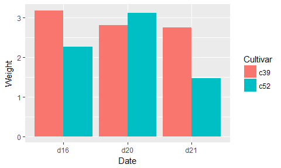<!-- -->

####Custom colour palette
To set the colors, cale_fill_brewer() or scale_fill_manual() can be used

```r
cabbage_exp
```

```
##   Cultivar Date Weight        sd  n         se
## 1      c39  d16   3.18 0.9566144 10 0.30250803
## 2      c39  d20   2.80 0.2788867 10 0.08819171
## 3      c39  d21   2.74 0.9834181 10 0.31098410
## 4      c52  d16   2.26 0.4452215 10 0.14079141
## 5      c52  d20   3.11 0.7908505 10 0.25008887
## 6      c52  d21   1.47 0.2110819 10 0.06674995
```

```r
ggplot(cabbage_exp, aes(x=Date, y=Weight, fill=Cultivar)) +
   geom_bar(stat = "identity", position="dodge", colour="black") +
   scale_fill_brewer(palette="Pastel1")
```

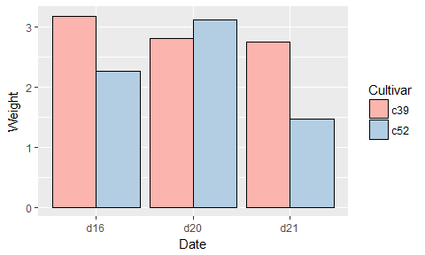<!-- -->


####Bar graph with count

```r
diamonds
```

```
## # A tibble: 53,940 x 10
##    carat       cut color clarity depth table price     x     y     z
##    <dbl>     <ord> <ord>   <ord> <dbl> <dbl> <int> <dbl> <dbl> <dbl>
##  1  0.23     Ideal     E     SI2  61.5    55   326  3.95  3.98  2.43
##  2  0.21   Premium     E     SI1  59.8    61   326  3.89  3.84  2.31
##  3  0.23      Good     E     VS1  56.9    65   327  4.05  4.07  2.31
##  4  0.29   Premium     I     VS2  62.4    58   334  4.20  4.23  2.63
##  5  0.31      Good     J     SI2  63.3    58   335  4.34  4.35  2.75
##  6  0.24 Very Good     J    VVS2  62.8    57   336  3.94  3.96  2.48
##  7  0.24 Very Good     I    VVS1  62.3    57   336  3.95  3.98  2.47
##  8  0.26 Very Good     H     SI1  61.9    55   337  4.07  4.11  2.53
##  9  0.22      Fair     E     VS2  65.1    61   337  3.87  3.78  2.49
## 10  0.23 Very Good     H     VS1  59.4    61   338  4.00  4.05  2.39
## # ... with 53,930 more rows
```

```r
ggplot(diamonds, aes(x=cut)) +
   geom_bar(stat = "count")
```

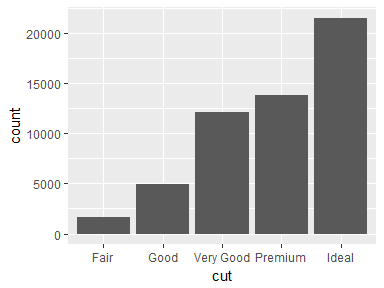<!-- -->

####Custom colour
Custom colours can be used with help of scale_fill_manual

```r
upc <- subset(uspopchange, rank(Change)>40)
upc
```

```
##             State Abb Region Change
## 3         Arizona  AZ   West   24.6
## 6        Colorado  CO   West   16.9
## 10        Florida  FL  South   17.6
## 11        Georgia  GA  South   18.3
## 13          Idaho  ID   West   21.1
## 29         Nevada  NV   West   35.1
## 34 North Carolina  NC  South   18.5
## 41 South Carolina  SC  South   15.3
## 44          Texas  TX  South   20.6
## 45           Utah  UT   West   23.8
```

```r
ggplot(upc, aes(x= Abb , y = Change, fill = Region)) +
 geom_bar(stat="identity") +
 scale_fill_manual(values=c("#ef98aa", "#c2e3ec")) +
 xlab("State")
```

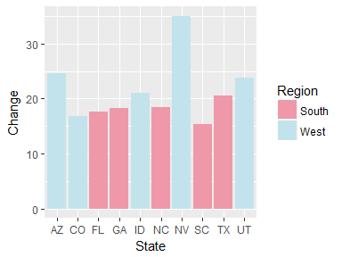<!-- -->

```r
#Sort data
ggplot(upc, aes(x= reorder(Abb,Change) , y = Change, fill = Region)) +
 geom_bar(stat="identity") +
 scale_fill_manual(values=c("#ef98aa", "#c2e3ec")) +
 xlab("State")
```

<!-- -->


####Bar graph with count

```r
diamonds
```

```
## # A tibble: 53,940 x 10
##    carat       cut color clarity depth table price     x     y     z
##    <dbl>     <ord> <ord>   <ord> <dbl> <dbl> <int> <dbl> <dbl> <dbl>
##  1  0.23     Ideal     E     SI2  61.5    55   326  3.95  3.98  2.43
##  2  0.21   Premium     E     SI1  59.8    61   326  3.89  3.84  2.31
##  3  0.23      Good     E     VS1  56.9    65   327  4.05  4.07  2.31
##  4  0.29   Premium     I     VS2  62.4    58   334  4.20  4.23  2.63
##  5  0.31      Good     J     SI2  63.3    58   335  4.34  4.35  2.75
##  6  0.24 Very Good     J    VVS2  62.8    57   336  3.94  3.96  2.48
##  7  0.24 Very Good     I    VVS1  62.3    57   336  3.95  3.98  2.47
##  8  0.26 Very Good     H     SI1  61.9    55   337  4.07  4.11  2.53
##  9  0.22      Fair     E     VS2  65.1    61   337  3.87  3.78  2.49
## 10  0.23 Very Good     H     VS1  59.4    61   338  4.00  4.05  2.39
## # ... with 53,930 more rows
```

```r
ggplot(diamonds, aes(x=cut)) +
   geom_bar(stat = "count")
```

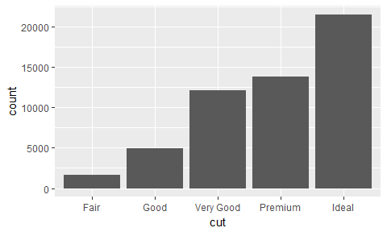<!-- -->

####Positive and Negative Bars - Opsite direction

* stat = "identity"
* position = "identity"


```r
climate %>%
  filter(Source == "Berkeley" & Year >= 1900) %>%
  mutate(Status = Anomaly10y >= 0) %>%
  ggplot(aes(x = Year, y = Anomaly10y, fill = Status )) +
  geom_bar(stat = "identity", position = "identity")
```

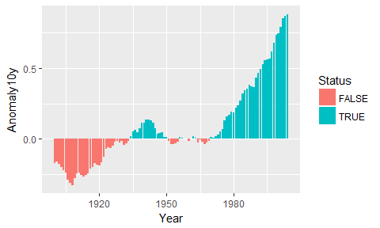<!-- -->

####Proportional stacked bar graph

```r
prop_wt_tbl <- cabbage_exp %>%
  group_by(Date,Cultivar) %>%
  summarise(sw = sum(Weight)) %>%
  mutate(prop = sw/sum(sw)*100)

prop_wt_tbl
```

```
## # A tibble: 6 x 4
## # Groups:   Date [3]
##     Date Cultivar    sw     prop
##   <fctr>   <fctr> <dbl>    <dbl>
## 1    d16      c39  3.18 58.45588
## 2    d16      c52  2.26 41.54412
## 3    d20      c39  2.80 47.37733
## 4    d20      c52  3.11 52.62267
## 5    d21      c39  2.74 65.08314
## 6    d21      c52  1.47 34.91686
```

```r
ggplot(prop_wt_tbl, aes(x=Date, y=prop, fill=Cultivar)) +
  geom_bar(stat="identity", colour="black") +
  scale_fill_brewer(palette="Pastel1")
```

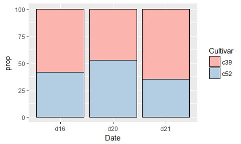<!-- -->


####Labels to bar

```r
diamonds_cut_sum <- diamonds %>%
                  count(cut)

diamonds_cut_sum
```

```
## # A tibble: 5 x 2
##         cut     n
##       <ord> <int>
## 1      Fair  1610
## 2      Good  4906
## 3 Very Good 12082
## 4   Premium 13791
## 5     Ideal 21551
```

```r
ggplot(diamonds_cut_sum, aes(x=cut, y=n)) +
  geom_bar(stat = "identity") +
  geom_text(aes(label=n), vjust=-0.2) 
```

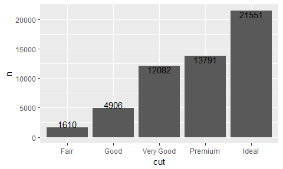<!-- -->

```r
ggplot(diamonds_cut_sum, aes(x=cut, y=n)) +
  geom_bar(stat = "identity") +
  geom_text(aes(label=n), vjust=1.5, colour="white") 
```

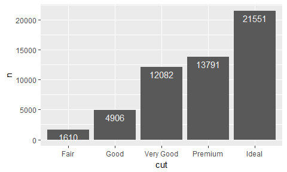<!-- -->

```r
##outward vs inward
```


####Cleveland Dot plot.

* By default, character vector will be ordered alphabetically. 
* By default, Factor would use the order defined in the factor levels.
* Re-ordering name based on values. ie. reorder(name, avg). This turns name is ordered factor.
* reorder() function will only order factor levels by one other variable


```r
top_records <- tophitters2001[1:25,]
top_records[, c("name", "lg", "avg")]
```

```
##                 name lg    avg
## 1       Larry Walker NL 0.3501
## 2      Ichiro Suzuki AL 0.3497
## 3       Jason Giambi AL 0.3423
## 4     Roberto Alomar AL 0.3357
## 5        Todd Helton NL 0.3356
## 6        Moises Alou NL 0.3314
## 7      Lance Berkman NL 0.3310
## 8         Bret Boone AL 0.3307
## 9  Frank Catalanotto AL 0.3305
## 10     Chipper Jones NL 0.3304
## 11     Albert Pujols NL 0.3288
## 12       Barry Bonds NL 0.3277
## 13        Sammy Sosa NL 0.3276
## 14       Juan Pierre NL 0.3274
## 15     Juan Gonzalez AL 0.3252
## 16     Luis Gonzalez NL 0.3251
## 17      Rich Aurilia NL 0.3239
## 18      Paul Lo Duca NL 0.3196
## 19        Jose Vidro NL 0.3189
## 20    Alex Rodriguez AL 0.3180
## 21       Cliff Floyd NL 0.3171
## 22   Shannon Stewart AL 0.3156
## 23      Jeff Cirillo NL 0.3125
## 24       Jeff Conine AL 0.3111
## 25       Derek Jeter AL 0.3111
```

```r
ggplot(top_records, aes(x=avg, y=name)) +
  geom_point(size=3)
```

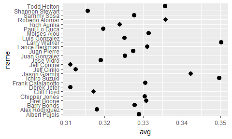<!-- -->

```r
ggplot(top_records, aes(x=avg, y=reorder(name, avg))) +
  geom_point(size=3) + # Use a larger dot
  theme_bw() +
  theme(panel.grid.major.x = element_blank(),
        panel.grid.minor.x = element_blank(),
        panel.grid.major.y = element_line(colour="grey60", linetype="dashed"))
```

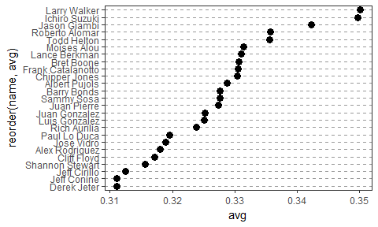<!-- -->

```r
#swap axis
ggplot(top_records, aes(x=reorder(name, avg), y=avg)) +
  geom_point(size=3) + 
  theme_bw() +
  theme(axis.text.x = element_text(angle=60, hjust=1),
        panel.grid.major.y = element_blank(),
        panel.grid.minor.y = element_blank(),
        panel.grid.major.x = element_line(colour="grey60", linetype="dashed"))
```

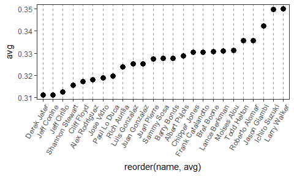<!-- -->

```r
top_records$name[order(top_records$lg)]
```

```
##  [1] "Ichiro Suzuki"     "Jason Giambi"      "Roberto Alomar"   
##  [4] "Bret Boone"        "Frank Catalanotto" "Juan Gonzalez"    
##  [7] "Alex Rodriguez"    "Shannon Stewart"   "Jeff Conine"      
## [10] "Derek Jeter"       "Larry Walker"      "Todd Helton"      
## [13] "Moises Alou"       "Lance Berkman"     "Chipper Jones"    
## [16] "Albert Pujols"     "Barry Bonds"       "Sammy Sosa"       
## [19] "Juan Pierre"       "Luis Gonzalez"     "Rich Aurilia"     
## [22] "Paul Lo Duca"      "Jose Vidro"        "Cliff Floyd"      
## [25] "Jeff Cirillo"
```

```r
top_records$name[order(top_records$lg, top_records$avg)]
```

```
##  [1] "Jeff Conine"       "Derek Jeter"       "Shannon Stewart"  
##  [4] "Alex Rodriguez"    "Juan Gonzalez"     "Frank Catalanotto"
##  [7] "Bret Boone"        "Roberto Alomar"    "Jason Giambi"     
## [10] "Ichiro Suzuki"     "Jeff Cirillo"      "Cliff Floyd"      
## [13] "Jose Vidro"        "Paul Lo Duca"      "Rich Aurilia"     
## [16] "Luis Gonzalez"     "Juan Pierre"       "Sammy Sosa"       
## [19] "Barry Bonds"       "Albert Pujols"     "Chipper Jones"    
## [22] "Lance Berkman"     "Moises Alou"       "Todd Helton"      
## [25] "Larry Walker"
```

```r
#color dot based on group
ggplot(top_records, aes(x=avg, y=reorder(name, avg))) +
  geom_segment(aes(yend=name), xend=0, colour="grey50") + #line tail
  geom_point(size=3, aes(colour=lg)) +
  scale_colour_brewer(palette="Set1", limits=c("NL","AL")) +
  theme_bw() +
  theme(panel.grid.major.y = element_blank(), # No horizontal grid lines
        legend.position=c(1, 0.55), # Put legend inside plot area
        legend.justification=c(1, 0.5))
```

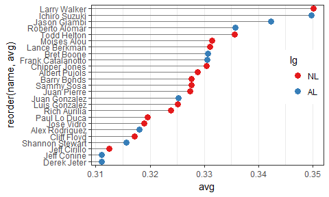<!-- -->

```r
#facet_grid + and within group name sorted by avg
ggplot(top_records, aes(x=avg, y=reorder(name, avg))) +
  geom_segment(aes(yend=name), xend=0, colour="grey50") +
  geom_point(size=3, aes(colour=lg)) +
  scale_colour_brewer(palette="Set1", limits=c("NL","AL"), guide=FALSE) +
    theme_bw() +
    theme(panel.grid.major.y = element_blank()) +
    facet_grid(lg ~ ., scales="free_y", space="free_y")
```

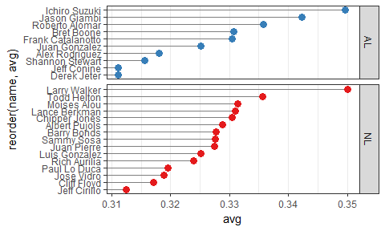<!-- -->
