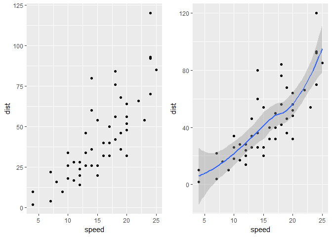

# Predictive Analysis
Sumon Barua  
  


Examples were taken from the book: 
  
  * Graphics Cookbook: Practical Recipes for Visualizing Data
  * Cookbook for R


```r
#install.packages("tidyverse")
#install.packages("gridExtra")
library(tidyverse)
```

```
## Loading tidyverse: ggplot2
## Loading tidyverse: tibble
## Loading tidyverse: tidyr
## Loading tidyverse: readr
## Loading tidyverse: purrr
## Loading tidyverse: dplyr
```

```
## Conflicts with tidy packages ----------------------------------------------
```

```
## filter(): dplyr, stats
## lag():    dplyr, stats
```

```r
library(gridExtra)
```

```
## Warning: package 'gridExtra' was built under R version 3.4.2
```

```
## 
## Attaching package: 'gridExtra'
```

```
## The following object is masked from 'package:dplyr':
## 
##     combine
```


####Correlation Analysis

* Level of linear dependence two variables
* Range of correlation coefficient -> -1 to +1
* Perfect positive relationship    -> +1
* Perfect Negative relationship    -> -1
* No linear relationship           -> 0
* Good relationship                -> >+-0.85
* Correlation is positive when the values increase together
* Correlation is negative when one decreases when other value increases
* Scatter plot helps to identify correlation visually
* Correlation works well when the relationship is a straight line
* Sometimes calculation may not pick up relationship but visuals can
* Correlation is not causation - Correlation does not mean that one thing causes other.


```r
diamonds
```

```
## # A tibble: 53,940 x 10
##    carat       cut color clarity depth table price     x     y     z
##    <dbl>     <ord> <ord>   <ord> <dbl> <dbl> <int> <dbl> <dbl> <dbl>
##  1  0.23     Ideal     E     SI2  61.5    55   326  3.95  3.98  2.43
##  2  0.21   Premium     E     SI1  59.8    61   326  3.89  3.84  2.31
##  3  0.23      Good     E     VS1  56.9    65   327  4.05  4.07  2.31
##  4  0.29   Premium     I     VS2  62.4    58   334  4.20  4.23  2.63
##  5  0.31      Good     J     SI2  63.3    58   335  4.34  4.35  2.75
##  6  0.24 Very Good     J    VVS2  62.8    57   336  3.94  3.96  2.48
##  7  0.24 Very Good     I    VVS1  62.3    57   336  3.95  3.98  2.47
##  8  0.26 Very Good     H     SI1  61.9    55   337  4.07  4.11  2.53
##  9  0.22      Fair     E     VS2  65.1    61   337  3.87  3.78  2.49
## 10  0.23 Very Good     H     VS1  59.4    61   338  4.00  4.05  2.39
## # ... with 53,930 more rows
```

```r
ggplot(diamonds, aes(x=carat, y=price)) +
  geom_point()
```

<!-- -->

####Scatter Plot

* Good relationship


####Simple linear regression / univariate regression

* This identifies linear relationship between predictor/independent and response/dependent.
* This predicts response variable based on the independent variable.
* An extension of correlation.
* One response variable and a single independent variable
* Best fitting straight line for a scatter plot between two variables
* The function lm fits a linear model to data
* Coefficient measures the slope of the relationship
* A type of supervised statistical learning approach that is useful for predicting a quantitative response Y
* intercept + slope * Independent variable + error term
* intercept and slope are also called beta coefficient
* Scatter plot :Indicates the relationship between variables
* Boxplot plot :To identify outlier
* Density plot :Distribustion of independent variable
* Hypothesis : p-Value is associated with Null and alternate hypothesis
* Null hypothesis: this is the initial hypothesis assuming there is no relationship (associated coefficient is equal to zero)
* It is very important for the model to be statistically significant before we decide to use it
* p-Value < pre-determined level(0.05) indicates that the model is statistically significance and we can reject Null hypothesis
* More stars are next to p-Value means more statistically signigicant
* Higher the t-value, the better
* tilde(~) indicates "depends on"
* Residual = Observed - Predicted


```r
head(cars)
```

```
##   speed dist
## 1     4    2
## 2     4   10
## 3     7    4
## 4     7   22
## 5     8   16
## 6     9   10
```

```r
str(cars)
```

```
## 'data.frame':	50 obs. of  2 variables:
##  $ speed: num  4 4 7 7 8 9 10 10 10 11 ...
##  $ dist : num  2 10 4 22 16 10 18 26 34 17 ...
```

```r
p1 <- ggplot(cars, aes(x=speed, y=dist)) +
  geom_point()

p2 <- ggplot(cars, aes(x=speed, y=dist)) +
  geom_point() +
  geom_smooth()

grid.arrange(p1, p2, ncol=2)
```

```
## `geom_smooth()` using method = 'loess'
```

<!-- -->

```r
#normality check
par(mfrow=c(1,2))
qqnorm(cars$speed)
qqline(cars$speed)
qqnorm(cars$dist)
qqline(cars$dist)
```

<!-- -->

```r
#outliers
par(mfrow=c(1,2))
boxplot(cars$speed, main="speed")
boxplot(cars$dist, main="dist")
```

<!-- -->

```r
#check normal distribution
p1 <- ggplot(data = NULL, aes(x = cars$speed)) +
        geom_histogram(aes(y = ..density..), colour="black", fill="white") +
        geom_density(alpha=.2, fill="#FF6666") +
        geom_vline(aes(xintercept=mean(cars$speed, na.rm = T)), color="red", linetype="dashed", size=1)

p2 <- ggplot(data = NULL, aes(x = cars$dist)) +
        geom_histogram(aes(y = ..density..), colour="black", fill="white") +
        geom_density(alpha=.2, fill="#FF6666") +
        geom_vline(aes(xintercept=mean(cars$dist, na.rm = T)), color="red", linetype="dashed", size=1)

grid.arrange(p1, p2, ncol=2)
```

```
## `stat_bin()` using `bins = 30`. Pick better value with `binwidth`.
```

```
## `stat_bin()` using `bins = 30`. Pick better value with `binwidth`.
```

<!-- -->

```r
#correlation
cor(cars$speed, cars$dist)
```

```
## [1] 0.8068949
```

```r
#Simple linear model
#response~independent
model_simplelm <- lm(dist~speed, data = cars)
summary(model_simplelm)
```

```
## 
## Call:
## lm(formula = dist ~ speed, data = cars)
## 
## Residuals:
##     Min      1Q  Median      3Q     Max 
## -29.069  -9.525  -2.272   9.215  43.201 
## 
## Coefficients:
##             Estimate Std. Error t value Pr(>|t|)    
## (Intercept) -17.5791     6.7584  -2.601   0.0123 *  
## speed         3.9324     0.4155   9.464 1.49e-12 ***
## ---
## Signif. codes:  0 '***' 0.001 '**' 0.01 '*' 0.05 '.' 0.1 ' ' 1
## 
## Residual standard error: 15.38 on 48 degrees of freedom
## Multiple R-squared:  0.6511,	Adjusted R-squared:  0.6438 
## F-statistic: 89.57 on 1 and 48 DF,  p-value: 1.49e-12
```

####Predicting Simple linear model

* Split data into training and test set
* Training data : 80% of the data
* Test data : Remaining 20% of the data
* Build model based on traing data
* Now predict test data using above model


```r
ds <- cars

set.seed(123)
#split training and sample data
ds.training.index <- sample(1:nrow(cars), 0.8*nrow(cars))
ds.training <- ds[ds.training.index,]
ds.test <- ds[-ds.training.index,]

#buil model based on training data
ds.training.fit <- lm(dist~speed, data = ds.training)
#test data prediction
ds.test$dist_predicted <- predict(ds.training.fit, ds.test)

#display result
ds.test
```

```
##    speed dist dist_predicted
## 5      8   16       15.79952
## 6      9   10       19.53972
## 10    11   17       27.02011
## 12    12   14       30.76030
## 16    13   26       34.50049
## 17    13   34       34.50049
## 33    18   56       53.20147
## 34    18   76       53.20147
## 37    19   46       56.94166
## 50    25   85       79.38283
```

```r
plot(ds.test$speed, ds.test$dist)
abline(ds.training.fit)
```

<!-- -->

```r
ds.training.fit$coefficients
```

```
## (Intercept)       speed 
##  -14.122031    3.740194
```

```r
ds.training.fit$coefficients[1] #intercept
```

```
## (Intercept) 
##   -14.12203
```

```r
ds.training.fit$coefficients[2] #slope
```

```
##    speed 
## 3.740194
```

```r
ggplot(ds.test, aes(x = speed, y = dist)) +
  geom_point() +
  geom_abline(intercept = ds.training.fit$coefficients[1], slope = ds.training.fit$coefficients[2])
```

<!-- -->

```r
#only with ggplot2
ggplot(cars, aes(x = speed, y = dist)) +
  geom_point() +
  geom_smooth(method = lm)
```

<!-- -->
