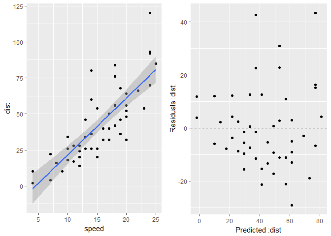

# Predictive Analysis
Sumon Barua  
  


```r
#install.packages("tidyverse")
#install.packages("gridExtra")
library(tidyverse)
```

```
## Loading tidyverse: ggplot2
## Loading tidyverse: tibble
## Loading tidyverse: tidyr
## Loading tidyverse: readr
## Loading tidyverse: purrr
## Loading tidyverse: dplyr
```

```
## Conflicts with tidy packages ----------------------------------------------
```

```
## filter(): dplyr, stats
## lag():    dplyr, stats
```

```r
library(gridExtra)
```

```
## Warning: package 'gridExtra' was built under R version 3.4.2
```

```
## 
## Attaching package: 'gridExtra'
```

```
## The following object is masked from 'package:dplyr':
## 
##     combine
```


####Correlation Analysis

* Level of linear dependence two variables
* Range of correlation coefficient -> -1 to +1
* Perfect positive relationship    -> +1
* Perfect Negative relationship    -> -1
* No linear relationship           -> 0
* Good relationship                -> >+-0.85
* Correlation is positive when the values increase together
* Correlation is negative when one decreases when other value increases
* Scatter plot helps to identify correlation visually
* Correlation works well when the relationship is a straight line
* Sometimes calculation may not pick up relationship but visuals can
* Correlation is not causation - Correlation does not mean that one thing causes other.


```r
diamonds
```

```
## # A tibble: 53,940 x 10
##    carat       cut color clarity depth table price     x     y     z
##    <dbl>     <ord> <ord>   <ord> <dbl> <dbl> <int> <dbl> <dbl> <dbl>
##  1  0.23     Ideal     E     SI2  61.5    55   326  3.95  3.98  2.43
##  2  0.21   Premium     E     SI1  59.8    61   326  3.89  3.84  2.31
##  3  0.23      Good     E     VS1  56.9    65   327  4.05  4.07  2.31
##  4  0.29   Premium     I     VS2  62.4    58   334  4.20  4.23  2.63
##  5  0.31      Good     J     SI2  63.3    58   335  4.34  4.35  2.75
##  6  0.24 Very Good     J    VVS2  62.8    57   336  3.94  3.96  2.48
##  7  0.24 Very Good     I    VVS1  62.3    57   336  3.95  3.98  2.47
##  8  0.26 Very Good     H     SI1  61.9    55   337  4.07  4.11  2.53
##  9  0.22      Fair     E     VS2  65.1    61   337  3.87  3.78  2.49
## 10  0.23 Very Good     H     VS1  59.4    61   338  4.00  4.05  2.39
## # ... with 53,930 more rows
```

```r
ggplot(diamonds, aes(x=carat, y=price)) +
  geom_point()
```

<!-- -->

####Scatter Plot

* Good relationship


####Regression

* Regression = Relationship among variables + test hypotheses about those relationships
* An extension of correlation.
* Scatter plot : 
      + Vertical(y) axis represents predicted/dependent/response value
      + Horizontal(x) axis represents predictor/independent/explanatory value
      + A line can be used to summarize the relationship
      + Best fitting/Regression line : There are number of lines could be drawn. The line that go through maximum number of points is the best fitting line. Slope and intercept are called regression coefficients. Coefficient measures the slope of the relationship
      + Intercept : The line intercepts the y-axis
      + Slope : Changes in X increase/decrease in Y
      + It is also important to know how the points vary arround the regression line with the help of residual and standard error.
* A regression line is a good fit if the residuals variance and standard error of estimate are small.      
* Response variable must be a continuous variable
* Predictors can be continuous, discrete or categorical


####Simple linear regression / univariate regression

* This identifies linear relationship between predictor/independent and response/dependent.
* This predicts response variable based on the independent variable.
* One response variable and a single independent variable
* Best fitting straight line for a scatter plot between two variables
* The function lm fits a linear model to data
* A type of supervised statistical learning approach that is useful for predicting a quantitative response Y
* intercept + slope * Independent variable + error term
* intercept and slope are also called beta coefficient
* Scatter plot :Indicates the relationship between variables
* Boxplot plot :To identify outlier
* Density plot :Distribustion of independent variable
* Hypothesis : p-Value is associated with Null and alternate hypothesis
* Null hypothesis: this is the initial hypothesis assuming there is no relationship (associated coefficient is equal to zero)
* It is very important for the model to be statistically significant before we decide to use it
* p-Value < pre-determined level(0.05) indicates that the model is statistically significance and we can reject Null hypothesis
* More stars are next to p-Value means more statistically signigicant
* Higher the t-value, the better
* tilde(~) indicates "depends on"
* Residual = Observed - Predicted
* The most useful way to plot the residuals, though, is with your predicted values on the x-axis, and your residuals on the y-axis. The distance from the line at 0 is how bad the prediction was for that value


```r
ds.response.variable <- "dist"
ds.predictor.variable <- "speed"
ds.source <- cars
ds.example.need.to.predict <- c(25,26,27,28,29,30)


ds <- ds.source[, c(ds.predictor.variable, ds.response.variable)]
names(ds) <- c("X", "Y")
ds
```

```
##     X   Y
## 1   4   2
## 2   4  10
## 3   7   4
## 4   7  22
## 5   8  16
## 6   9  10
## 7  10  18
## 8  10  26
## 9  10  34
## 10 11  17
## 11 11  28
## 12 12  14
## 13 12  20
## 14 12  24
## 15 12  28
## 16 13  26
## 17 13  34
## 18 13  34
## 19 13  46
## 20 14  26
## 21 14  36
## 22 14  60
## 23 14  80
## 24 15  20
## 25 15  26
## 26 15  54
## 27 16  32
## 28 16  40
## 29 17  32
## 30 17  40
## 31 17  50
## 32 18  42
## 33 18  56
## 34 18  76
## 35 18  84
## 36 19  36
## 37 19  46
## 38 19  68
## 39 20  32
## 40 20  48
## 41 20  52
## 42 20  56
## 43 20  64
## 44 22  66
## 45 23  54
## 46 24  70
## 47 24  92
## 48 24  93
## 49 24 120
## 50 25  85
```

```r
p1 <- ggplot(ds, aes(x=X, y=Y)) +
  geom_point() +
  labs(x=ds.predictor.variable, y=ds.response.variable)

p2 <- ggplot(ds, aes(x=X, y=Y)) +
  geom_point() +
  geom_smooth() +
  labs(x=ds.predictor.variable, y=ds.response.variable)

grid.arrange(p1, p2, ncol=2)
```

```
## `geom_smooth()` using method = 'loess'
```

<!-- -->

```r
#normality check
par(mfrow=c(1,2))
qqnorm(ds$X, xlab = ds.predictor.variable)
qqline(ds$X)
qqnorm(ds$Y, xlab = ds.response.variable)
qqline(ds$Y)
```

<!-- -->

```r
#outliers
par(mfrow=c(1,2))
boxplot(ds$X, main=ds.predictor.variable)
boxplot(ds$Y, main=ds.response.variable)
```

<!-- -->

```r
#check normal distribution
p1 <- ggplot(data = NULL, aes(x = ds$X)) +
        geom_histogram(aes(y = ..density..), colour="black", fill="white") +
        geom_density(alpha=.2, fill="#FF6666") +
        geom_vline(aes(xintercept=mean(ds$X, na.rm = T)), color="red", linetype="dashed", size=1) +
        labs(x=ds.predictor.variable)
  

p2 <- ggplot(data = NULL, aes(x = ds$Y)) +
        geom_histogram(aes(y = ..density..), colour="black", fill="white") +
        geom_density(alpha=.2, fill="#FF6666") +
        geom_vline(aes(xintercept=mean(ds$Y, na.rm = T)), color="red", linetype="dashed", size=1) +
        labs(x=ds.response.variable)

grid.arrange(p1, p2, ncol=2)
```

```
## `stat_bin()` using `bins = 30`. Pick better value with `binwidth`.
```

```
## `stat_bin()` using `bins = 30`. Pick better value with `binwidth`.
```

<!-- -->

```r
#correlation
cor(ds$X, ds$Y)
```

```
## [1] 0.8068949
```

```r
#Simple linear model
#response~independent
model_simplelm <- lm(Y~X, data = ds)
summary(model_simplelm)
```

```
## 
## Call:
## lm(formula = Y ~ X, data = ds)
## 
## Residuals:
##     Min      1Q  Median      3Q     Max 
## -29.069  -9.525  -2.272   9.215  43.201 
## 
## Coefficients:
##             Estimate Std. Error t value Pr(>|t|)    
## (Intercept) -17.5791     6.7584  -2.601   0.0123 *  
## X             3.9324     0.4155   9.464 1.49e-12 ***
## ---
## Signif. codes:  0 '***' 0.001 '**' 0.01 '*' 0.05 '.' 0.1 ' ' 1
## 
## Residual standard error: 15.38 on 48 degrees of freedom
## Multiple R-squared:  0.6511,	Adjusted R-squared:  0.6438 
## F-statistic: 89.57 on 1 and 48 DF,  p-value: 1.49e-12
```

```r
ds$Y_WholeDS_Prediction <- fitted(model_simplelm)
ds$Y_WholeDS_Residuals <- residuals(model_simplelm)

ds
```

```
##     X   Y Y_WholeDS_Prediction Y_WholeDS_Residuals
## 1   4   2            -1.849460            3.849460
## 2   4  10            -1.849460           11.849460
## 3   7   4             9.947766           -5.947766
## 4   7  22             9.947766           12.052234
## 5   8  16            13.880175            2.119825
## 6   9  10            17.812584           -7.812584
## 7  10  18            21.744993           -3.744993
## 8  10  26            21.744993            4.255007
## 9  10  34            21.744993           12.255007
## 10 11  17            25.677401           -8.677401
## 11 11  28            25.677401            2.322599
## 12 12  14            29.609810          -15.609810
## 13 12  20            29.609810           -9.609810
## 14 12  24            29.609810           -5.609810
## 15 12  28            29.609810           -1.609810
## 16 13  26            33.542219           -7.542219
## 17 13  34            33.542219            0.457781
## 18 13  34            33.542219            0.457781
## 19 13  46            33.542219           12.457781
## 20 14  26            37.474628          -11.474628
## 21 14  36            37.474628           -1.474628
## 22 14  60            37.474628           22.525372
## 23 14  80            37.474628           42.525372
## 24 15  20            41.407036          -21.407036
## 25 15  26            41.407036          -15.407036
## 26 15  54            41.407036           12.592964
## 27 16  32            45.339445          -13.339445
## 28 16  40            45.339445           -5.339445
## 29 17  32            49.271854          -17.271854
## 30 17  40            49.271854           -9.271854
## 31 17  50            49.271854            0.728146
## 32 18  42            53.204263          -11.204263
## 33 18  56            53.204263            2.795737
## 34 18  76            53.204263           22.795737
## 35 18  84            53.204263           30.795737
## 36 19  36            57.136672          -21.136672
## 37 19  46            57.136672          -11.136672
## 38 19  68            57.136672           10.863328
## 39 20  32            61.069080          -29.069080
## 40 20  48            61.069080          -13.069080
## 41 20  52            61.069080           -9.069080
## 42 20  56            61.069080           -5.069080
## 43 20  64            61.069080            2.930920
## 44 22  66            68.933898           -2.933898
## 45 23  54            72.866307          -18.866307
## 46 24  70            76.798715           -6.798715
## 47 24  92            76.798715           15.201285
## 48 24  93            76.798715           16.201285
## 49 24 120            76.798715           43.201285
## 50 25  85            80.731124            4.268876
```

```r
#only with ggplot2
ggplot(model_simplelm, aes(x = X, y = Y)) +
  geom_point() +
  geom_smooth(method = lm) +
  labs(x=ds.predictor.variable, y= ds.response.variable)
```

<!-- -->

####Predicting Simple linear model

* Split data into training and test set
* Training data : 80% of the data
* Test data : Remaining 20% of the data
* Build model based on traing data
* Now predict test data using above model


```r
#set.seed(123)
#split training and sample data
ds.training.index <- sample(1:nrow(ds), 0.8*nrow(ds))
ds.training <- ds[ds.training.index,]
ds.test <- ds[-ds.training.index,]

#buil model based on training data
ds.training.fit <- lm(Y~X, data = ds.training)
summary(ds.training.fit)
```

```
## 
## Call:
## lm(formula = Y ~ X, data = ds.training)
## 
## Residuals:
##     Min      1Q  Median      3Q     Max 
## -23.566  -8.499  -1.772   7.297  41.929 
## 
## Coefficients:
##             Estimate Std. Error t value Pr(>|t|)    
## (Intercept) -22.1145     8.0212  -2.757  0.00891 ** 
## X             4.2990     0.4975   8.640 1.68e-10 ***
## ---
## Signif. codes:  0 '***' 0.001 '**' 0.01 '*' 0.05 '.' 0.1 ' ' 1
## 
## Residual standard error: 15.5 on 38 degrees of freedom
## Multiple R-squared:  0.6627,	Adjusted R-squared:  0.6538 
## F-statistic: 74.66 on 1 and 38 DF,  p-value: 1.682e-10
```

```r
ds.training.pred <- data.frame (ds.training , Y_Prediction = fitted(ds.training.fit), Y_Residuals =residuals(ds.training.fit))

ds.training.pred
```

```
##     X   Y Y_WholeDS_Prediction Y_WholeDS_Residuals Y_Prediction
## 33 18  56            53.204263            2.795737    55.267326
## 29 17  32            49.271854          -17.271854    50.968335
## 44 22  66            68.933898           -2.933898    72.463289
## 49 24 120            76.798715           43.201285    81.061271
## 50 25  85            80.731124            4.268876    85.360262
## 12 12  14            29.609810          -15.609810    29.473381
## 20 14  26            37.474628          -11.474628    38.071362
## 9  10  34            21.744993           12.255007    20.875399
## 31 17  50            49.271854            0.728146    50.968335
## 10 11  17            25.677401           -8.677401    25.174390
## 1   4   2            -1.849460            3.849460    -4.918546
## 19 13  46            33.542219           12.457781    33.772372
## 23 14  80            37.474628           42.525372    38.071362
## 6   9  10            17.812584           -7.812584    16.576408
## 42 20  56            61.069080           -5.069080    63.865307
## 28 16  40            45.339445           -5.339445    46.669344
## 16 13  26            33.542219           -7.542219    33.772372
## 36 19  36            57.136672          -21.136672    59.566317
## 8  10  26            21.744993            4.255007    20.875399
## 22 14  60            37.474628           22.525372    38.071362
## 7  10  18            21.744993           -3.744993    20.875399
## 35 18  84            53.204263           30.795737    55.267326
## 18 13  34            33.542219            0.457781    33.772372
## 13 12  20            29.609810           -9.609810    29.473381
## 26 15  54            41.407036           12.592964    42.370353
## 41 20  52            61.069080           -9.069080    63.865307
## 43 20  64            61.069080            2.930920    63.865307
## 24 15  20            41.407036          -21.407036    42.370353
## 38 19  68            57.136672           10.863328    59.566317
## 14 12  24            29.609810           -5.609810    29.473381
## 34 18  76            53.204263           22.795737    55.267326
## 3   7   4             9.947766           -5.947766     7.978427
## 40 20  48            61.069080          -13.069080    63.865307
## 21 14  36            37.474628           -1.474628    38.071362
## 15 12  28            29.609810           -1.609810    29.473381
## 37 19  46            57.136672          -11.136672    59.566317
## 45 23  54            72.866307          -18.866307    76.762280
## 17 13  34            33.542219            0.457781    33.772372
## 48 24  93            76.798715           16.201285    81.061271
## 5   8  16            13.880175            2.119825    12.277417
##    Y_Residuals
## 33   0.7326743
## 29 -18.9683349
## 44  -6.4632891
## 49  38.9387293
## 50  -0.3602616
## 12 -15.4733807
## 20 -12.0713624
## 9   13.1246010
## 31  -0.9683349
## 10  -8.1743899
## 1    6.9185460
## 19  12.2276285
## 23  41.9286376
## 6   -6.5764082
## 42  -7.8653074
## 28  -6.6693440
## 16  -7.7723715
## 36 -23.5663165
## 8    5.1246010
## 22  21.9286376
## 7   -2.8753990
## 35  28.7326743
## 18   0.2276285
## 13  -9.4733807
## 26  11.6296468
## 41 -11.8653074
## 43   0.1346926
## 24 -22.3703532
## 38   8.4336835
## 14  -5.4733807
## 34  20.7326743
## 3   -3.9784265
## 40 -15.8653074
## 21  -2.0713624
## 15  -1.4733807
## 37 -13.5663165
## 45 -22.7622799
## 17   0.2276285
## 48  11.9387293
## 5    3.7225826
```

```r
#test data prediction
ds.test$Y_predicted <- predict(ds.training.fit, ds.test)


#display result
ds.test[, c('X', 'Y', 'Y_predicted')]
```

```
##     X  Y Y_predicted
## 2   4 10   -4.918546
## 4   7 22    7.978427
## 11 11 28   25.174390
## 25 15 26   42.370353
## 27 16 32   46.669344
## 30 17 40   50.968335
## 32 18 42   55.267326
## 39 20 32   63.865307
## 46 24 70   81.061271
## 47 24 92   81.061271
```

```r
plot(ds.test$X, ds.test$Y, xlab = ds.predictor.variable, ylab = ds.response.variable)
abline(ds.training.fit)
```

<!-- -->

```r
ds.training.fit$coefficients
```

```
## (Intercept)           X 
##  -22.114509    4.298991
```

```r
ds.training.fit$coefficients[1] #intercept
```

```
## (Intercept) 
##   -22.11451
```

```r
ds.training.fit$coefficients[2] #slope
```

```
##        X 
## 4.298991
```

```r
ggplot(ds.test, aes(x = X, y = Y)) +
  geom_point() +
  geom_abline(intercept = ds.training.fit$coefficients[1], slope = ds.training.fit$coefficients[2]) +
  labs(x=ds.predictor.variable, y=ds.response.variable)
```

<!-- -->

```r
#single value prediction

ds.example.predicted <- predict(ds.training.fit, data.frame(X = ds.example.need.to.predict))
data.frame(X=ds.example.need.to.predict, ds.example.predicted)
```

```
##    X ds.example.predicted
## 1 25             85.36026
## 2 26             89.65925
## 3 27             93.95824
## 4 28             98.25723
## 5 29            102.55622
## 6 30            106.85522
```


####Multiple regression / multivariate regression
