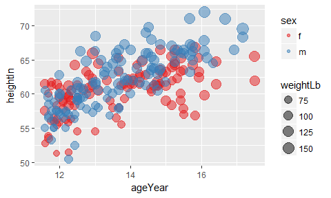

# Scallter Plot
Sumon Barua  
  


Examples were taken from the book: 
  
  * Graphics Cookbook: Practical Recipes for Visualizing Data
  * Cookbook for R


```r
#install.packages("tidyverse")
#install.packages("hexbin")
#install.packages("gcookbook")
library(tidyverse)
```

```
## Loading tidyverse: ggplot2
## Loading tidyverse: tibble
## Loading tidyverse: tidyr
## Loading tidyverse: readr
## Loading tidyverse: purrr
## Loading tidyverse: dplyr
```

```
## Conflicts with tidy packages ----------------------------------------------
```

```
## filter(): dplyr, stats
## lag():    dplyr, stats
```

```r
library(gcookbook)
library(hexbin)
```

```
## Warning: package 'hexbin' was built under R version 3.4.2
```

####Scatter Plot

* Relationship between two continuous variables
* Each observation is represented by a point


```r
head(heightweight[,c("ageYear", "heightIn")])
```

```
##   ageYear heightIn
## 1   11.92     56.3
## 2   12.92     62.3
## 3   12.75     63.3
## 4   13.42     59.0
## 5   15.92     62.5
## 6   14.25     62.5
```

```r
ggplot(heightweight, aes(x=ageYear, y=heightIn)) +
  geom_point()
```

<!-- -->

####Different shape+size for point

* Default is solid circles -> 16
* Default size is 2
* i.e. shape=21
* i.e. size=1.5
* Shape 19 is also a solid circle looks smoother


```r
ggplot(heightweight, aes(x=ageYear, y=heightIn)) +
  geom_point(shape=19, size=1.5)
```

<!-- -->

####Grouping data point by a variable - (factor) (color/shape)

* colour=variable_name -> part of aes
* shape=variable_name -> part of aes
* Group variable must be categorical/factor/character vector
* Numeric group variable : Numeric vector needs to converted to factor 
* http://ggplot2.tidyverse.org/reference/scale_brewer.html
* http://colorbrewer2.org/


```r
head(heightweight[, c("sex", "ageYear", "heightIn")])
```

```
##   sex ageYear heightIn
## 1   f   11.92     56.3
## 2   f   12.92     62.3
## 3   f   12.75     63.3
## 4   f   13.42     59.0
## 5   f   15.92     62.5
## 6   f   14.25     62.5
```

```r
ggplot(heightweight, aes(x=ageYear, y=heightIn, colour=sex)) +
  geom_point()
```

<!-- -->

```r
ggplot(heightweight, aes(x=ageYear, y=heightIn, shape=sex)) +
  geom_point()
```

<!-- -->

```r
ggplot(heightweight, aes(x=ageYear, y=heightIn, shape=sex, colour=sex)) +
  geom_point() +
  scale_shape_manual(values=c(1,2)) +
  scale_colour_brewer(palette="Set1")
```

<!-- -->


####Grouping data point by a continuous variable - (numerical) (color/shape) 

* More than 2 Continuous variables
    + First  -> x
    + Second -> y
    + Third  -> color/size
  

```r
head(heightweight[, c("sex", "ageYear", "heightIn", "weightLb")])
```

```
##   sex ageYear heightIn weightLb
## 1   f   11.92     56.3     85.0
## 2   f   12.92     62.3    105.0
## 3   f   12.75     63.3    108.0
## 4   f   13.42     59.0     92.0
## 5   f   15.92     62.5    112.5
## 6   f   14.25     62.5    112.0
```

```r
ggplot(heightweight, aes(x=ageYear, y=heightIn, colour=sex)) +
  geom_point()
```

<!-- -->

```r
ggplot(heightweight, aes(x=ageYear, y=heightIn, size=weightLb, colour=sex)) +
 geom_point(alpha=.5) +
 scale_size_area() + # Make area proportional to numeric value
 scale_colour_brewer(palette="Set1")
```

<!-- -->

####Overplotting

* Overplotting: Points in a scatter plot may obscure each other and prevent the viewer from accurately assessing the distribution of the data.


```r
 ggplot(diamonds, aes(x=carat, y=price)) +
 geom_point()
```

<!-- -->

```r
 ggplot(diamonds, aes(x=carat, y=price)) +
 geom_point(alpha=0.01)
```

<!-- -->

```r
  ggplot(diamonds, aes(x=carat, y=price)) +
  stat_bin2d(bins = 50) +
  scale_fill_gradient(low = "lightblue", high = "red", limits = c(0,6000))  
```

<!-- -->

```r
  ggplot(diamonds, aes(x=carat, y=price)) +
  stat_binhex() + # from hexbin library
  scale_fill_gradient(low = "lightblue", high = "red", limits = c(0,8000))  
```

<!-- -->
