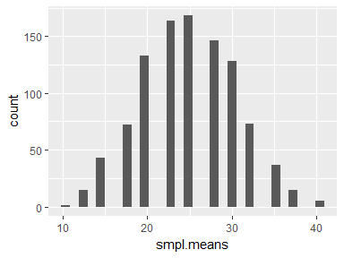

# Statistics
Sumon Barua  


####Sampling Distribution


```r
library(ggplot2)

#population
values <- c( 10,20,30,40)
#probabilities
probabilities <- c( 1/4, 1/4, 1/4, 1/4)
#store sample means
smpl.means <- NULL

set.seed( 123)

for( i in 1: 1000)
{ 
  #generate sample
  smpl <- sample( x = values, prob = probabilities, size = 4, replace = TRUE) 
  #append to vector - mean of the above sample
  smpl.means <- append( smpl.means, mean( smpl)) 
}

#Histogram - Normal distribution
ggplot( NULL, aes( x = smpl.means)) + 
  geom_histogram()
```

```
## `stat_bin()` using `bins = 30`. Pick better value with `binwidth`.
```

<!-- -->

```r
#unique values - for x-axis labeling
m.values <-round( unique( smpl.means), 2)


ggplot( NULL, aes( x = smpl.means)) + 
  geom_histogram() + 
  scale_x_continuous( breaks = m.values, label = m.values) + 
  scale_y_continuous( expand = c( 0,0)) + 
  labs( x = expression( bar( X)), y = expression (frequency( bar( X))))
```

```
## `stat_bin()` using `bins = 30`. Pick better value with `binwidth`.
```

<!-- -->
