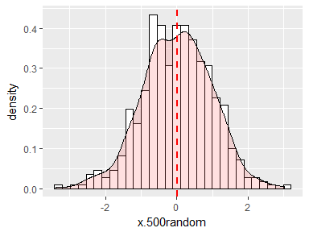
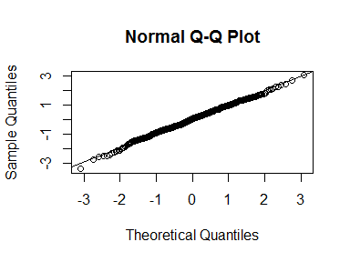

# Statistics
Sumon Barua  


```r
library(ggplot2)
```
####Normal Density

* Data can be spread out/distributed in different ways. When data tends to be around a central value with no bias left or right, and it gets close to a "Normal Distribution" 
* mean = median = mode
* 50% of values less than the mean and 50% greater than the mean
* Density plot provides a visual judgment about whether the distribution is bell shaped


```r
x.values <- seq(40, 160, 1)
x.sd.values <- seq(40, 160, 15)
x.zeros.values <- rep(0, 9)

ggplot(data = NULL, aes(x = x.values, y = dnorm(x.values, 100, 15))) +
  geom_line() +
  labs(x = "x", y = "f(x)") + 
  scale_x_continuous(breaks = x.sd.values, labels = x.sd.values) +
  geom_segment((
      aes( x = x.sd.values, y = x.zeros.values, xend = x.sd.values, yend = dnorm(x.sd.values, m = 100, s = 15))
              ), linetype = "dashed") +
  scale_y_continuous( expand = c( 0,0))
```

<!-- -->

```r
#500 random numbers
x.500random <- rnorm(500)
ggplot(data = NULL, aes(x = x.500random)) +
  geom_histogram(aes(y = ..density..), colour="black", fill="white") +
  geom_density(alpha=.2, fill="#FF6666") 
```

```
## `stat_bin()` using `bins = 30`. Pick better value with `binwidth`.
```

<!-- -->

####Normality Test

* Normality test by visual inspection and by significance tests
* Based on The central limit theorem - the sampling distribution tends to be normal if the sample is large enough (n > 30)

shapiro.test

* p low null go(out)
* p high null fly(in)
* The null hypothesis of these tests is that "sample distribution is normal". 


```r
shapiro.test(x.500random)
```

```
## 
## 	Shapiro-Wilk normality test
## 
## data:  x.500random
## W = 0.99515, p-value = 0.1197
```


```r
qqnorm(x.500random)
qqline(x.500random)
```

<!-- -->


####Sampling Distribution


```r
library(ggplot2)

#population
values <- c( 10,20,30,40)
#probabilities
probabilities <- c( 1/4, 1/4, 1/4, 1/4)
#store sample means
smpl.means <- NULL

set.seed( 123)

for( i in 1: 1000)
{ 
  #generate sample
  smpl <- sample( x = values, prob = probabilities, size = 4, replace = TRUE) 
  #append to vector - mean of the above sample
  smpl.means <- append( smpl.means, mean( smpl)) 
}

#Histogram - Normal distribution
ggplot( NULL, aes( x = smpl.means)) + 
  geom_histogram()
```

```
## `stat_bin()` using `bins = 30`. Pick better value with `binwidth`.
```

<!-- -->

```r
#unique values - for x-axis labeling
m.values <-round( unique( smpl.means), 2)


ggplot( NULL, aes( x = smpl.means)) + 
  geom_histogram() + 
  scale_x_continuous( breaks = m.values, label = m.values) + 
  scale_y_continuous( expand = c( 0,0)) + 
  labs( x = expression( bar( X)), y = expression (frequency( bar( X))))
```

```
## `stat_bin()` using `bins = 30`. Pick better value with `binwidth`.
```

<!-- -->


